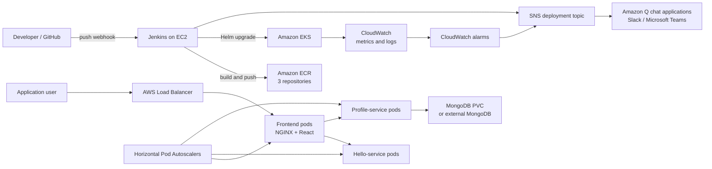

# System Architecture

## Design decisions

- Three independent images allow each component to be built, released, and
  scaled separately.
- The browser communicates only with the frontend. NGINX proxies `/api/hello`
  and `/api/profile` to Kubernetes services, so cluster DNS names are not
  exposed to the browser.
- Every stateless component starts with two replicas and has CPU-based
  horizontal autoscaling from 2 to 6 replicas.
- Readiness probes prevent traffic from reaching unavailable pods. The profile
  readiness endpoint checks MongoDB connectivity.
- Pod disruption budgets preserve one available replica during voluntary node
  maintenance.
- MongoDB is included for an academic/demo environment. For production, set
  `mongodb.enabled=false` and provide an external database URL through a
  Kubernetes Secret.
- Images use immutable Git commit tags as well as the convenience `latest` tag.

## Request flow

1. The load balancer sends traffic to the frontend service.
2. NGINX serves the React files.
3. `/api/hello` is proxied to `hello-service:3001`.
4. `/api/profile/*` is proxied to `profile-service:3002`.
5. The profile service reads and writes user records in MongoDB.

## CI/CD flow

1. A push to GitHub invokes the Jenkins webhook.
2. Jenkins checks out the commit, tests/builds the frontend, and verifies
   backend dependencies.
3. Jenkins builds three Docker images.
4. Images are scanned on push and stored in separate ECR repositories.
5. Jenkins authenticates to EKS and runs `helm upgrade --install`.
6. Helm waits for a successful rollout.
7. Jenkins optionally publishes success or failure to SNS.
